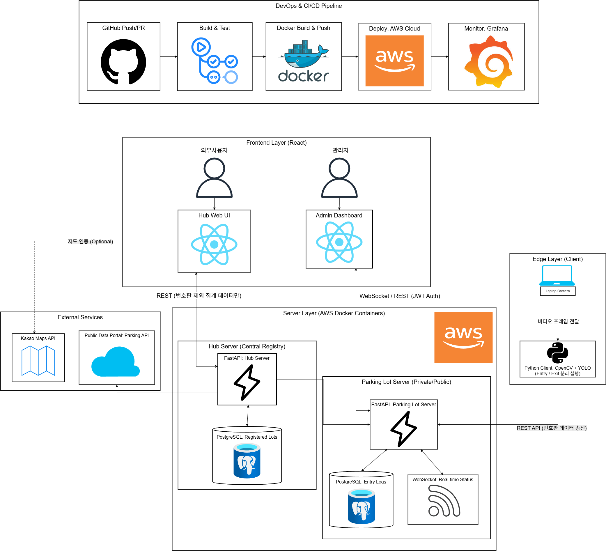

<p align="center">
  
</p>

# OpenPark

> 오픈소스 주차장 관리 플랫폼

OpenPark는 소규모 민간 주차장도 고가의 전용 장비 없이 주차 관리 시스템을 도입할 수 있도록 돕는 오픈소스 프로젝트입니다. 일반 웹캠 또는 엣지 디바이스에서 차량 번호판을 인식하고, 주차장 서버에서 입출차 기록과 잔여 공간을 관리하며, 허브 서버와 웹 UI를 통해 민간/공영 주차장 정보를 통합 제공합니다.

## Why OpenPark?

도심 교통체증의 상당 부분은 주차 공간을 찾기 위해 배회하는 차량에서 발생합니다. 기존 통합 주차 정보 서비스는 주로 공영 주차장 데이터에 집중되어 있어, 소규모 민간 주차장의 실시간 정보를 함께 다루기 어렵습니다.

OpenPark는 번호판 인식 클라이언트, 주차장 관리 서버, 통합 정보 허브, 프론트엔드를 분리된 컴포넌트로 구성하여 각 주차장이 필요한 방식으로 직접 운영하거나 확장할 수 있게 설계했습니다.

## Repository Structure

| Repository                                                                             | Role                                        | Stack                       |
| -------------------------------------------------------------------------------------- | ------------------------------------------- | --------------------------- |
| [`Deploy`](https://github.com/KNU-2026S-OSP-TEAM01/Deploy)                             | OpenPark 전체 실행 및 배포 스크립트         | Shell, Docker               |
| [`Client`](https://github.com/KNU-2026S-OSP-TEAM01/Client)                             | 차량 번호판 인식 및 입출차 이벤트 전송      | Python, OpenCV, YOLO        |
| [`Parking-Lot-Backend`](https://github.com/KNU-2026S-OSP-TEAM01/Parking-Lot-Backend)   | 주차장별 입출차 기록, 잔여 공간, 관리자 API | FastAPI, PostgreSQL, Docker |
| [`Hub-Backend`](https://github.com/KNU-2026S-OSP-TEAM01/Hub-Backend)                   | 민간/공영 주차장 정보 통합 API 및 라우팅    | FastAPI, PostgreSQL, Docker |
| [`Parking-Lot-Frontend`](https://github.com/KNU-2026S-OSP-TEAM01/Parking-Lot-Frontend) | 관리자 대시보드와 통합 주차장 현황 UI       | TypeScript, React, Docker   |
| [`.github`](https://github.com/KNU-2026S-OSP-TEAM01/.github)                           | Organization profile, PR/Issue template     | Markdown                    |

## Architecture

<p align="center">
  
</p>

OpenPark는 차량 번호판 원본 데이터를 외부에 노출하지 않고, 외부 사용자에게는 총 공간과 잔여 공간 같은 주차장 상태 정보만 제공합니다.

## Quick Start

OpenPark를 실행하려면 배포 저장소를 clone한 뒤 환경 파일을 만들고 제공된 스크립트를 실행합니다.

```bash
git clone https://github.com/KNU-2026S-OSP-TEAM01/Deploy.git
cd Deploy

cp .env.example .env

scripts/env.sh
scripts/deploy.sh
```

실행 전에 `.env` 파일의 값을 로컬 또는 서버 환경에 맞게 수정하세요.

## Main Features

- 번호판 자동 인식 및 입출차 이벤트 생성
- 입출차 기록 저장과 주차장 잔여 공간 관리
- 관리자 로그인, 주차장 등록, 사용자 등록
- 민간 주차장 API와 공영 주차장 OpenAPI 응답 포맷 통합
- 민간/공영 주차장 통합 현황 UI
- 지도 API 연동을 통한 실시간 주차장 상태 시각화

## Components

### Client

웹캠 또는 엣지 디바이스에서 차량 번호판을 인식하고, 파싱된 번호판 정보와 입출차 타입, 주차장 ID, 타임스탬프를 Parking Lot Backend로 전송합니다. 초기 검증은 PC 웹캠 기반으로 진행하며, 이후 라즈베리파이 환경에 맞춘 모델 경량화와 이식을 목표로 합니다.

### Parking Lot Backend

각 주차장의 입출차 기록을 저장하고 관리자 화면에 필요한 차량 목록, 잔여 공간, 실시간 상태 업데이트 API를 제공합니다. 자체 서버를 운영할 수 있는 관리자는 Private 서버로, 인프라 관리가 어려운 관리자는 Public 서버로 사용할 수 있습니다.

### Hub Backend

민간 주차장 정보와 공영 주차장 OpenAPI를 하나의 포맷으로 통합합니다. 민간 주차장 요청은 등록된 Parking Lot Backend로 라우팅하고, 공영 주차장 요청은 대구광역시 통합주차정보시스템 OpenAPI와 연동합니다.

### Frontend

관리자용 대시보드와 외부 사용자용 주차장 현황 화면을 제공합니다. 관리자는 입출차 현황과 잔여 공간을 확인하고, 사용자는 민간/공영 주차장 목록과 실시간 주차 가능 정보를 확인할 수 있습니다.

### Deploy

Frontend, Parking Lot Backend, Hub Backend를 Docker 기반으로 실행하고 배포하기 위한 환경 설정과 스크립트를 관리합니다.

## License

OpenPark는 MIT License 기반의 오픈소스 프로젝트입니다. 자세한 내용은 각 저장소의 `LICENSE` 파일을 확인해주세요.
